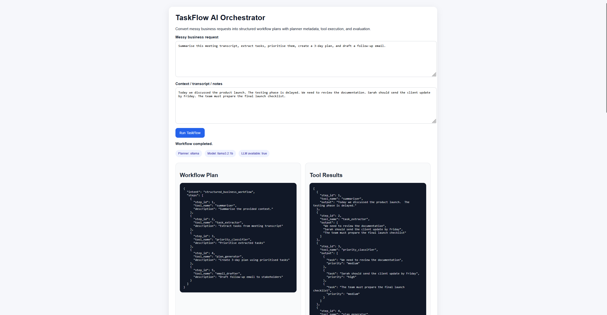

# TaskFlow AI Orchestrator

TaskFlow AI Orchestrator is a clean-room LLM workflow automation API that converts messy business requests into structured, validated multi-step task plans.

It demonstrates practical AI workflow engineering using local LLM planning, schema validation, modular tool routing, workflow execution, and output evaluation.

## Core Features

- Local LLM workflow planning with Ollama
- Rule-based fallback planner when the LLM is unavailable or returns invalid output
- Pydantic schema validation for workflow plans and results
- Modular tool execution pipeline
- Built-in workflow evaluator
- FastAPI API endpoints
- Built-in browser demo UI
- Pytest coverage for workflow and parser behaviour
- Example proof outputs for successful Ollama mode and fallback mode

## Tech Stack

Python | FastAPI | Pydantic | Ollama | Local LLMs | Uvicorn | Pytest | HTML/CSS/JavaScript

## What TaskFlow Does

A user can provide a messy business request such as:

```text
Summarise this meeting transcript, extract tasks, prioritise them, create a 3-day plan, and draft a follow-up email.
## Demo UI

TaskFlow includes a built-in FastAPI browser UI for testing workflow orchestration locally.

